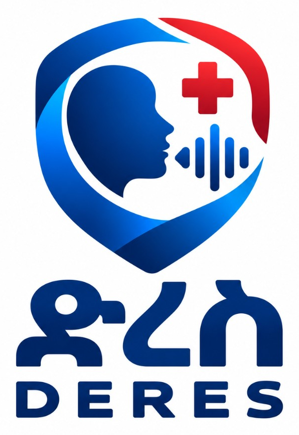

# ድረስ (DERES)



**ድረስ (DERES)** is a multilingual, voice-guided **web** platform for untrained bystanders in Ethiopia. It covers the minutes between the start of an emergency and the arrival of professional responders. It runs in the browser on a phone or a computer.

Speech is interpreted by a language model. Every medical instruction is taken from a published protocol. The model does not compose treatment. Ambulance **907** stays on every emergency screen.

---

## Key features

### Voice-guided bystander flow
- **No account.** Start an emergency immediately.
- **Language choice:** English, Amharic (አማርኛ), or Afaan Oromoo. The session greets, listens, and speaks in that language.
- **Name the scene first:** collapse, crash or injury, possible stroke, choking, severe bleeding, burn, or something else.
- **One step at a time:** one spoken question or action. Large buttons run the same path if the microphone cannot be used.
- **Barge-in:** tap the microphone while DERES is speaking to interrupt and answer.

### Protocol-locked first aid
- Six first-minute paths: unresponsive adult, traumatic injury, suspected stroke (FAST), choking, severe bleeding, and burns.
- Scenes without a published protocol escalate to **call 907**. DERES does not invent a procedure.
- The language model extracts facts (what was said). The protocol engine decides the next line. Voxide speaks that line.

### Live incident record
- Known facts, unknowns, and confirmed actions stay on the incident.
- Optional browser location is attached for responders.
- A structured timeline is kept as the scene changes.

### Responder dashboard
- Invite-code access for professionals (not a public signup).
- Live incident list by urgency.
- Handoff view: warnings, facts with certainty, actions already taken, location, and timeline.

DERES does not replace emergency services or medical professionals. It does not diagnose, prescribe, or dispatch ambulances.

---

## Technology stack

### Web (`apps/web`)
- **Framework:** [React 19](https://react.dev/) + [Vite](https://vitejs.dev/)
- **Styling:** [Tailwind CSS 4](https://tailwindcss.com/)
- **Routing:** [React Router 7](https://reactrouter.com/)
- **Data:** [TanStack Query](https://tanstack.com/query)
- **Realtime:** [Socket.IO client](https://socket.io/)
- **Voice (browser):** [Voxide](https://voxide.ai/) / Gemini Live — hears and speaks; does not choose medical text

### API (`apps/server`)
- **Runtime:** [Node.js](https://nodejs.org/) 20+ & [Express 5](https://expressjs.com/)
- **Database:** [MongoDB Atlas](https://www.mongodb.com/) & [Mongoose](https://mongoosejs.com/)
- **Realtime:** [Socket.IO](https://socket.io/)
- **Extraction LLM:** OpenAI-compatible Chat Completions (`LLM_API_KEY`, `LLM_BASE_URL`, `LLM_MODEL`)
- **Auth:** HMAC responder tokens (invite). Bystander flow is anonymous.

### Shared packages
- `@voicesos/shared` — types, enums, API contracts
- `@voicesos/protocols` — published first-aid protocols (clinical copy, not execution)

---

## Getting started

### Prerequisites
- Node.js 20 or later
- npm (workspaces)
- MongoDB Atlas connection string
- OpenAI-compatible LLM key
- Voxide publishable key (`vox_pub_…`) for spoken voice in the browser

### 1. Clone and install

```bash
git clone https://github.com/Obsann/DERES.git
cd DERES
npm install
```

### 2. Environment

**API** — copy `.env.example` to `.env` at the repository root (or `apps/server/.env`):

```env
NODE_ENV=development
PORT=4000
MONGODB_URI=your_mongodb_connection_string
LLM_API_KEY=your_llm_key
LLM_BASE_URL=https://api.openai.com/v1
LLM_MODEL=gpt-4o-mini
CLIENT_URL=http://localhost:5173
SESSION_SECRET=change-me
RESPONDER_INVITE=your-invite-phrase
```

`VOXIDE_API_KEY` is optional. Browser voice uses the web publishable key, not this variable.

**Web** — copy `apps/web/.env.example` to `apps/web/.env`:

```env
VITE_API_URL=http://localhost:4000
VITE_VOXIDE_PUBLIC_KEY=vox_pub_...
VITE_EMERGENCY_NUMBER=907
```

Whitelist `localhost` (automatic) and any deployed host in the Voxide dashboard. Paste the agent prompt from `docs/voice/voxide-setup.md`. Leave the dashboard greeting empty.

### 3. Run

Two terminals, from the repository root:

```bash
npm run dev:server
```

API: `http://localhost:4000` — check `http://localhost:4000/api/health`

```bash
npm run dev:web
```

UI: `http://localhost:5173`

### 4. Test

```bash
npm test
npm run typecheck
```

---

## Using the demo

**Bystander** — open `/`, choose a language, start an emergency, allow the microphone. Buttons still run the protocol if voice is unavailable.

**Responder** — open `/responder`. Sign in with any email and the `RESPONDER_INVITE` passphrase from your `.env`. There is no public patient login.

---

## Project structure

```text
DERES/
├── apps/
│   ├── web/                      # React + Vite UI
│   │   ├── public/               # Logo, icons, PWA manifest
│   │   └── src/
│   │       ├── pages/emergency/  # Start, language, live session
│   │       ├── pages/responder/  # Invite gate, list, handoff
│   │       ├── services/voice/   # Voxide bind, greeting, barge-in
│   │       ├── i18n/             # Screen copy (en / am / om)
│   │       └── hooks/            # Voice, location, API
│   └── server/                   # Express API
│       └── src/
│           ├── ai/               # LLM extraction + safety pipeline
│           ├── protocols/        # Protocol engine (safety boundary)
│           ├── incidents/        # Emergency state
│           ├── voice/            # Voice turns and classification
│           ├── handoff/          # Responder summary
│           ├── security/         # Responder invite tokens
│           └── realtime/         # Socket.IO
├── packages/
│   ├── shared/                   # Shared types and contracts
│   └── protocols/                # Published first-aid text
├── docs/
│   ├── deploy.md                 # Render (API) + Vercel (web)
│   └── voice/voxide-setup.md     # Dashboard prompt and languages
└── package.json                  # npm workspaces
```

---

## Deploy

Production is **Render** (API) + **Vercel** (web) + **MongoDB Atlas**. Root directory stays at the repository root. Set `CLIENT_URL` on Render to the Vercel origin (no trailing slash). Full steps: [`docs/deploy.md`](docs/deploy.md).

---

DERES is not a doctor, not a chatbot that invents advice, and not a replacement for ambulance 907.

*Team COD1 · STARK Hackathon 2026*
